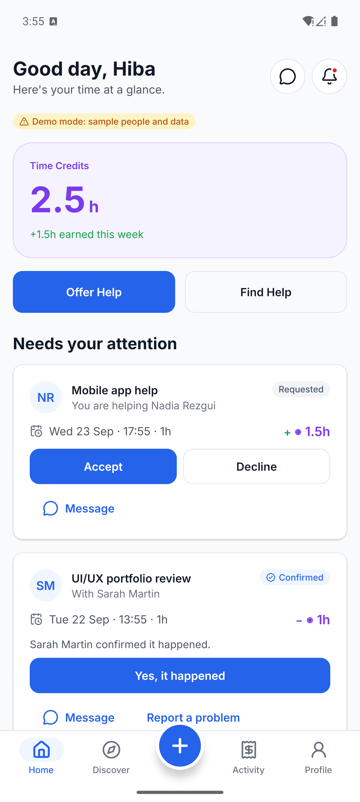
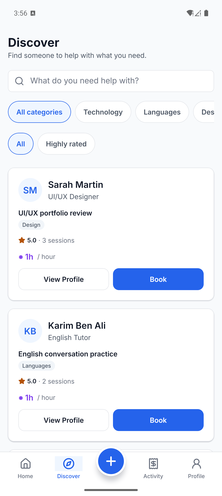
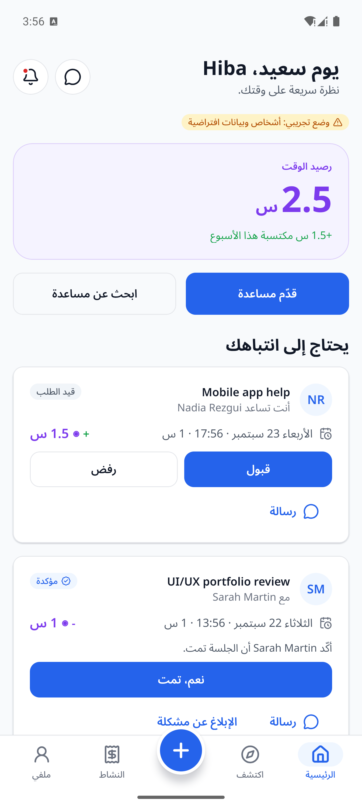

# TimeBank

A community platform where people exchange time and skills instead of money. Teach someone English for an hour, earn a Time Credit; spend it later when you need your CV reviewed. Everyone has something worth an hour of someone else's time.

Built with **Expo / React Native** (iOS, Android, web from one codebase) and **Supabase** (Postgres, auth, row-level security).

## Screenshots

| Home | Discover | Arabic (RTL) |
|---|---|---|
|  |  |  |

## Principal features

- **Time Credit ledger** — an append-only, database-enforced ledger. Booking reserves credits immediately; credits are paid out only once both people confirm a session happened. Double-spending is prevented at the database level, not just in the app.
- **Skill marketplace** — offer a skill, search and filter by category, book a session in two steps (choose a time, confirm credits).
- **Booking & availability** — providers set weekly availability windows; only bookable slots are shown, and the server rejects anything outside them.
- **Trust & reputation** — ratings, completed sessions, and hours given are shown as separate signals rather than one opaque score.
- **Chat, notifications & reviews** — messaging tied to each session, in-app notifications for every state change, and post-session reviews that feed back into trust.
- **Safety** — report and block, with a moderation screen for reviewing disputed sessions and reports.
- **Levels & badges** — light gamification (Newcomer → Community Builder) based on time contributed; nothing is gated behind it.
- **Adaptive layout** — one codebase that adapts from a compact phone to a sidebar layout on tablets, foldables and web, using the window size rather than the device model.
- **Internationalization** — English, French and Arabic, including full right-to-left layout, localized plurals, and dates.
- **Demo mode** — with no backend configured, the app runs on an in-memory demo backend with sample people who respond automatically, so the whole flow can be explored with no account.

## Project structure

```
App.tsx                  Entry point
src/
  theme/                 Design tokens, light/dark theme
  layout/                Adaptive layout (compact / medium / expanded)
  components/            Reusable UI components
  navigation/            Tab bar, sidebar, screen routing
  screens/                Screens (Home, Discover, Activity, Profile, Book, Chat, Admin, ...)
  data/                  Api interface + Supabase and in-memory demo implementations
  auth/                  Supabase auth provider
  i18n/                  Translation catalogs (en/fr/ar) and helpers
  lib/                   Formatting, availability, levels, toasts
supabase/
  migrations/            SQL schema, credit ledger, RLS policies (run in order)
  tests/                 SQL and API integration tests
  README.md              Backend setup instructions
tests/                   Unit tests (i18n, demo backend, pure logic)
```

## Getting started

```bash
npm install
npm run web      # or: npx expo start --ios / --android
```

Without a backend configured, the app runs in **demo mode** — no account needed.

### Connect a real backend

1. Create a project at [supabase.com](https://supabase.com).
2. In the SQL Editor, run every file in `supabase/migrations/`, in order.
3. Copy `.env.example` to `.env` and fill in your project URL and anon key.

See [`supabase/README.md`](supabase/README.md) for details on how the credit system works.

## Testing

```bash
npm run test:unit   # i18n, demo backend, pure logic — no dependencies needed
npm test            # also runs the SQL + API test suite against a throwaway Postgres (needs Docker)
```
